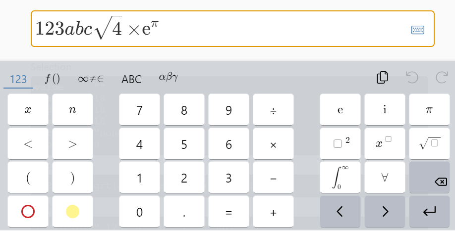

# react-native-mathlive




## Installation

```sh
npm install react-native-mathlive
```

## Usage

```js
import {Mathfield} from 'react-native-mathlive';

// ...

return (
    ...
    <Mathfield />
    ...
);
```

## Contributing

See the [contributing guide](CONTRIBUTING.md) to learn how to contribute to the repository and the development workflow.

## License

MIT
